# Redis: The Complete Developer's Guide

## Section 2: Commands for Adding and Querying Data

* ```redis
    SET message 'Hi message!'
    GET message
    ```

* 

* 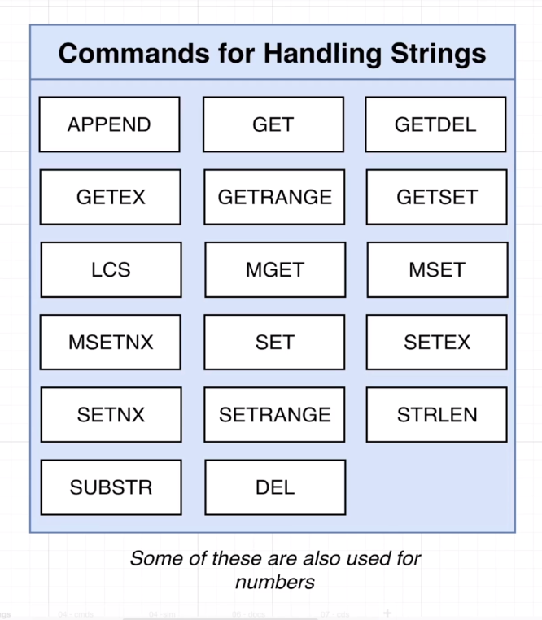

* 

* 

* redis.io/commands

* 

* 
    * As an example, the `expiration` parameter is super useful when we are caching information a database.

* 

* 

* 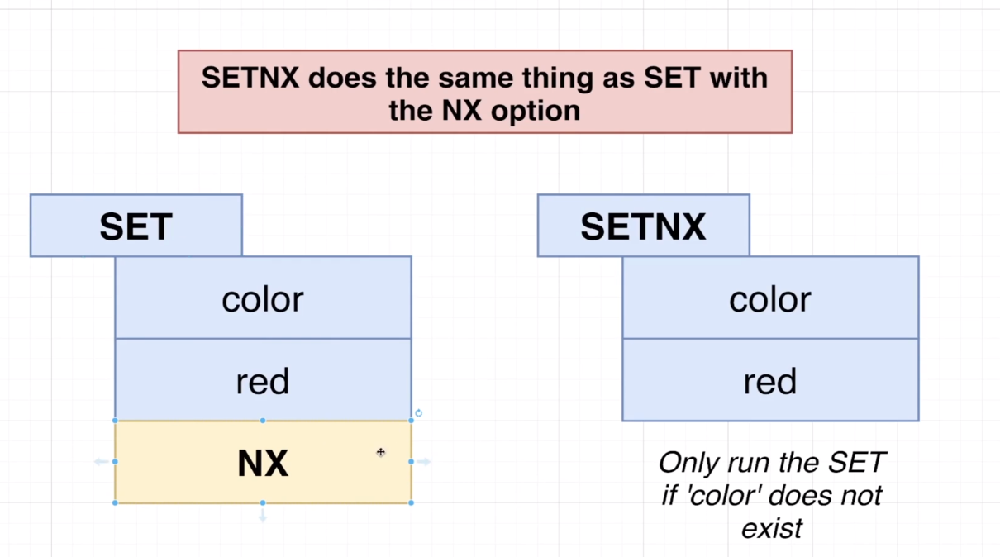

* 

* 

* 

* 

* 

* 

* 

* 

* 

* 

* 

* 

* 

* 

* 

* 

* 
    * Those commands exist because of race conditions. One example would be two separate servers running the same backend code doing a `GET`, increamenting the value and after that doing a `SET`. At some point those two servers would `GET` the same value and override each others increment operation. This is a typical race condition.

* 

## Section 4: Local Redis Setup

* `Redis Stack` contains the core Redis database and some additional modules that extend the functionality of Redis.

* If you do not already have HomeBrew installed, navigate to https://brew.sh/ and run the command at the top in your terminal to install HomeBrew

* At your terminal, run `brew tap redis-stack/redis-stack`

* At your terminal, run `brew install redis-stack`

* To start Redis, run `redis-stack-server`

* To connect to your local Redis server and execute commands, run `redis-cli`

## Hashes in Redis

* 

* 

* 

* 

* 

* 

* 

* 

* 

* 
    * If you try to increment a key that does not exist, it will create it automatically.

* 

* 

## Section 8: Pipelining Commands

* Redis Pipelining
    * A Request/Response server can be implemented so that it is able to process new requests even if the client hasn't already read the old responses. This way it is possible to send multiple commands to the server without waiting for the replies at all, and finally read the replies in a single step.

    * This is called pipelining, and is a technique widely in use for many decades. For instance many POP3 protocol implementations already support this feature, dramatically speeding up the process of downloading new emails from the server.

## Section 9: Enforcing Uniqueness with Sets


* 

* 

* 

* 

* 

* 

* 

* 

* 
    * The first `set` dictates the intersect result.

* 

* 

* 

* 

* 

* 

* 

* 

## Section 11: Organizing Data with Sorted Sets

* 

* 

* 

* 

* 

* 

* 

* 

* 

* 

* 

* 

* 

* 

* 

* 

* 

* 

* 

* 

* 
    * `REV` reverts the sorted set from `ASC` to `DSC`.

## Section 13: From Relational Data to Redis

* 
    * `SORT` is a great way to `JOIN` data. You can first get a set of `keys` from a `set` and the use that to search for other `keys`.
        * e.g. `books:*->year`. The `*` is used to look for other keys.

* 

* 

* 

* 

* 

* 

* 

* 

* 

* 

* 

## Section 14: HyeperLogLog Structures

* 

* 

* 

* 

* 

* 

* 


## Section 15: Storing Collections with Lists

* 

* 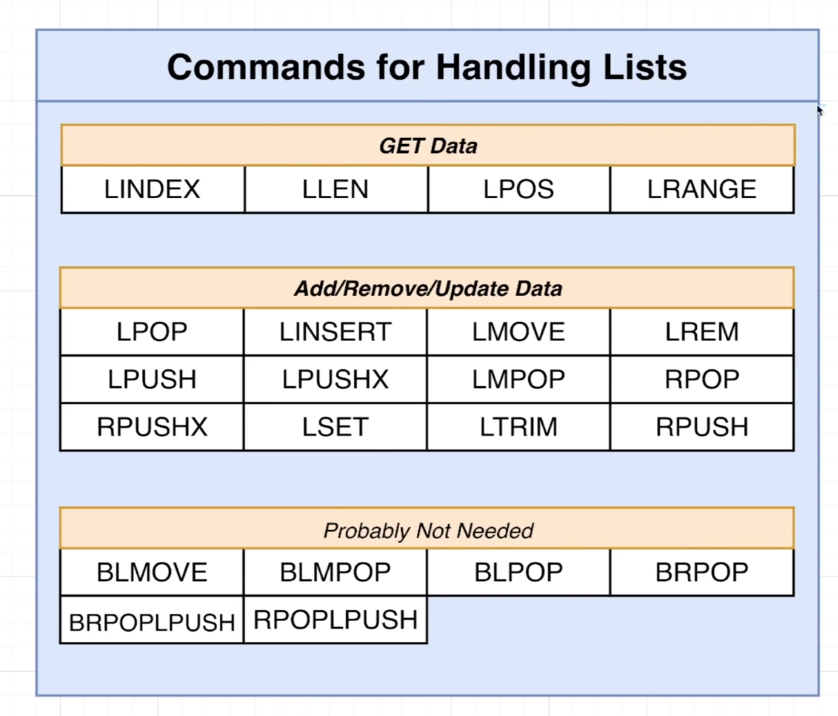

* 

* 

* 

* 

* 

* 

* 

* 

* 

* 

* 

* 

* 

* 

* 

* 

* 

* 

* 

* 

## Section 16: Transactions

* 

* 

* 

* 
    * `MULTI` is used for a transaction containing many commands.

* 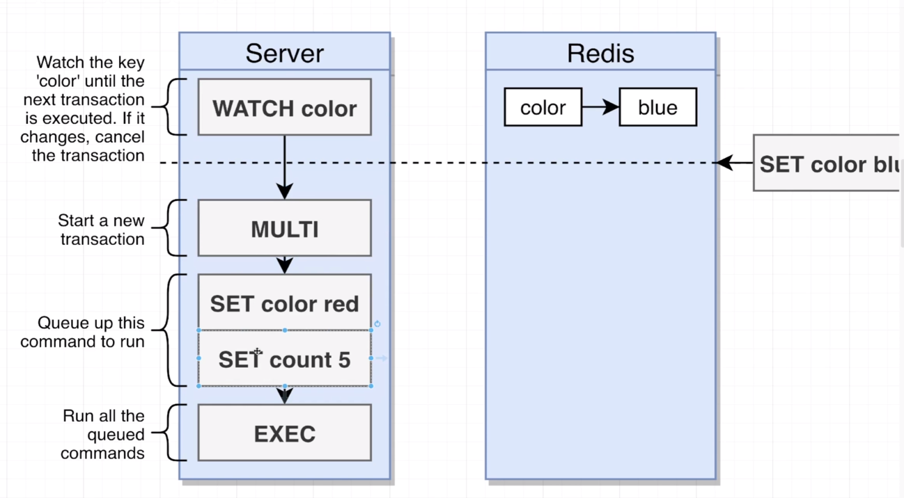
    * As soon as `WATCH` is called on a `key`, it will watch for changes on that `key`. If any change happens, and we try to do a `MULTI` with a set of commands, as soon as we call `EXEC` the transaction will fail.
    * All the commands in a transaction are serialized and executed sequentially. **A request sent by another client will never be served in the middle of the execution of a Redis Transaction.** This guarantees that the commands are executed as a single isolated operation.
    * `WATCH` helps us to `GET` values and evalute if changes happened.

* 

## Section 17: Extending Redis with Scripting

* 

* 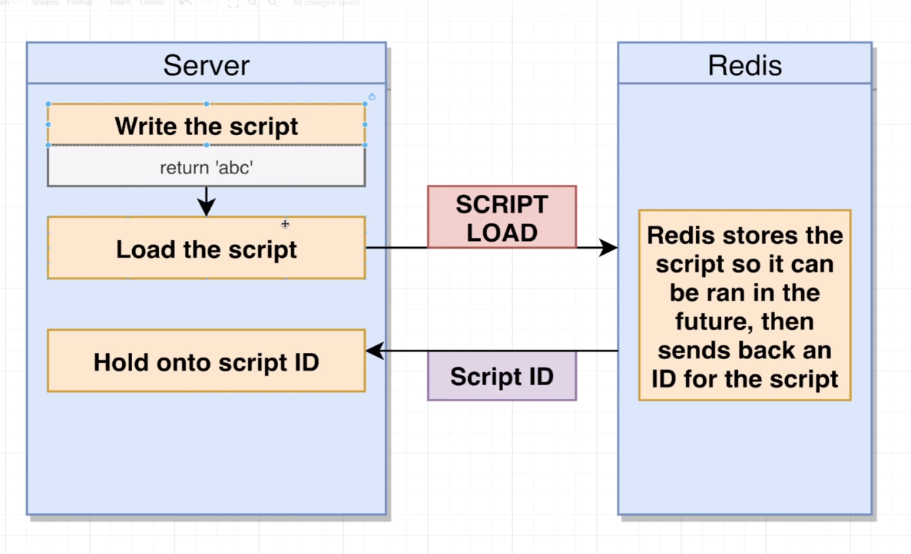

* 

* 

* 

* 

* 

* 

* 

* 
    * The advantage of Lua script is that we can execute custom redis operations on Redis not available in the redis commands arsenal & redis does not allow any operation until script is executed end to end.

* 

* 

* 

## Section 18: Understanding and Solving Concurrency Issues

* 

* 
    * We could "RETRY" this operation many times to circumvent issues with `WATCH` failing on some transactions.

* 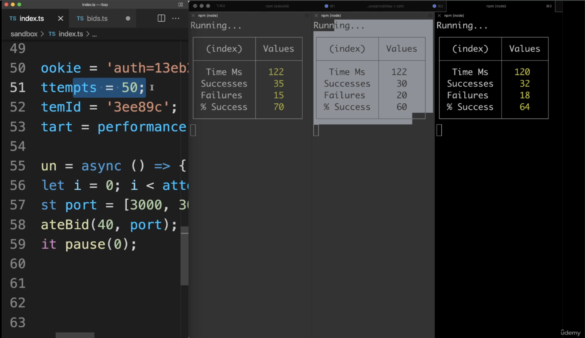
    * In this example we spin 3 processes and we track how many transactions fail using `WATCH`. No retries in this case.

* 

* 

* 

* 

* 

* 

* 

* 

* 

* 

* ```js
    import { createClient, defineScript } from 'redis';
    import { itemsKey, itemsByViewsKey, itemsViewsKey } from '$services/keys';

    const client = createClient({
        socket: {
            host: process.env.REDIS_HOST,
            port: parseInt(process.env.REDIS_PORT)
        },
        password: process.env.REDIS_PW,
        scripts: {
            // This is the script registered
            unlock: defineScript({
                NUMBER_OF_KEYS: 1,
                transformArguments(key: string, token: string) {
                    return [key, token];
                },
                transformReply(reply: any) {
                    return reply;
                },
                SCRIPT: `
                    if redis.call('GET', KEYS[1]) == ARGV[1] then
                        return redis.call('DEL', KEYS[1])
                    end
                `
            })
        }
    );

    client.on('error', (err) => console.error(err));
    client.connect();

    export { client };
    ```

* ```js
    import { client } from './client';
    import { randomBytes } from 'crypto';

    export const withLock = async (key: string, cb: (signal: any) => any) => {
        // Initialize a few variables to control retry behavior
        const retryDelayMs = 100;
        let retries = 20;

        // Generate a random value to store at the lock key
        const token = randomBytes(6).toString('hex');
        // Create the lock key
        const lockKey = `lock:${key}`;

        // Set up a while loop to implement the retry behavior
        while (retries >= 0) {
            retries--;
            // Try to do a SET NX operation
            const acquired = await client.set(lockKey, token, {
                NX: true,
                PX: 2000
            });

            if (!acquired) {
                // ELSE brief pause (retryDelayMs) and then retry
                await pause(retryDelayMs);
                continue;
            }

            // IF the set is successful, then run the callback
            try {
                const signal = { expired: false };
                setTimeout(() => {
                    signal.expired = true;
                }, timeoutMs);

                const proxiedClient = buildClientProxy(timeoutMs);
                const result = await cb(proxiedClient, signal);
                return result;
            } finally {
                await client.unlock(lockKey, token);
            }
        }
    };

    type Client = typeof client;
    const buildClientProxy = (timeoutMs: number) => {
        const startTime = Date.now();

        const handler = {
            get(target: Client, prop: keyof Client) {
                if (Date.now() >= startTime + timeoutMs) {
                    throw new Error('Lock has expired.');
                }

                const value = target[prop];
                return typeof value === 'function' ? value.bind(target) : value;
            }
        };
        // The Proxy object enables you to create a proxy for another object, which can intercept and redefine fundamental operations for that object.
	    return new Proxy(client, handler) as Client;
    };

    const pause = (duration: number) => {
        return new Promise((resolve) => {
            setTimeout(resolve, duration);
        });
    };
    ```

* ```js
    import type { CreatSubAttrs, Bid } from '$services/types';
    import { bidHistoryKey, itemsKey, itemsByPriceKey } from '$services/keys';
    import { client, withLock } from '$services/redis';
    import { DateTime } from 'luxon';
    import { getItem } from './items';

    const pause = (duration: number) => {
        return new Promise((resolve) => {
            setTimeout(resolve, duration);
        });
    };

    // The following is the callback that is acting as client to make use of the acquired lock

    export const createSubs = async (attrs: CreateSubsAttrs) => {
        return withLock(attrs.itemId, async (lockedClient: typeof client, signal: any) => {
            // 1) Fetching the item
            // 2) Doing validation
            // 3) Writing some data
            const item = await getItem(attrs.itemId);

            if (!item) {
                throw new Error('Item does not exist');
            }
            if (item.price >= attrs.amount) {
                throw new Error('Bid too low');
            }
            if (item.endingAt.diff(DateTime.now()).toMillis() < 0) {
                throw new Error('Item closed to bidding');
            }

            const serialized = serializeHistory(attrs.amount, attrs.createdAt.toMillis());

            if (signal.expired) {
                throw new Error('Lock expired, cant write any more data');
            }

            return Promise.all([
                lockedClient.rPush(bidHistoryKey(attrs.itemId), serialized),
                lockedClient.hSet(itemsKey(item.id), {
                    bids: item.bids + 1,
                    price: attrs.amount,
                    highestBidUserId: attrs.userId
                }),
                lockedClient.zAdd(itemsByPriceKey(), {
                    value: item.id,
                    score: attrs.amount
                })
            ]);
	    });


        const serializeHistory = (amount: number, createdAt: number) => {
            return `${amount}:${createdAt}`;
        };

        const deserializeHistory = (stored: string) => {
            const [amount, createdAt] = stored.split(':');

            return {
                amount: parseFloat(amount),
                createdAt: DateTime.fromMillis(parseInt(createdAt))
            };
        };
    };
    ```

## Section 19: Querying Data with RediSearch

* 

* 

* 
    * Get raw source code of module, compile it, load the module using `MODULE LOAD` on Redis.

* 
    * An alternative copy of Redis containing additional modules.

* 

* 

* 

* 

* 
    * Instead using Redis Core and maintaining a sorted set and other structures to do search on a hash map item, we could use Redis Search and create an index to do such query.

* 

* 

* 

* 

* 

* 

* 

* 

* 

* 

* 

* 

* 

* 

* 

* 

## Section 20: Search In Action

* 

* 

* 

* 

* 

* 

* 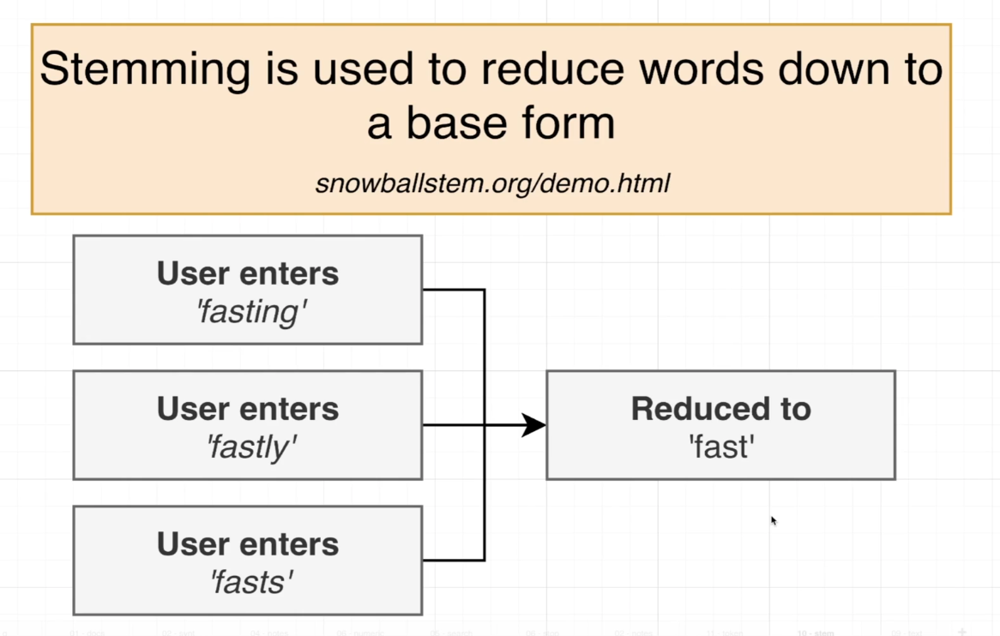

* 

* 

* 

* 

* 

* 

* 

* 

* 

* 

* 

* 

* 

* 

* 

* 

* 

* 

* 

* 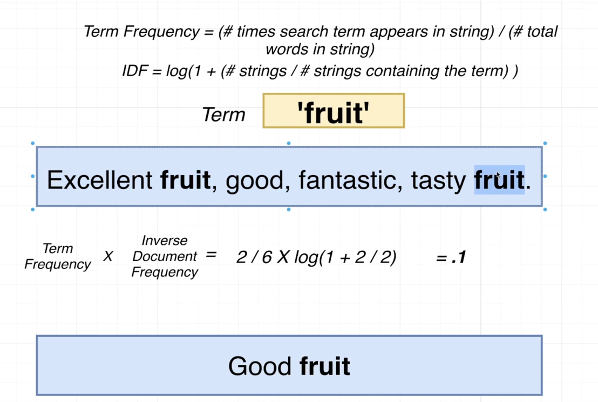

* 

* 

* 

* 

* 

* 

* 

* 

* 

* 

* 

* 

* 

* 

* 

* 

* 

* 

* 

* 

* 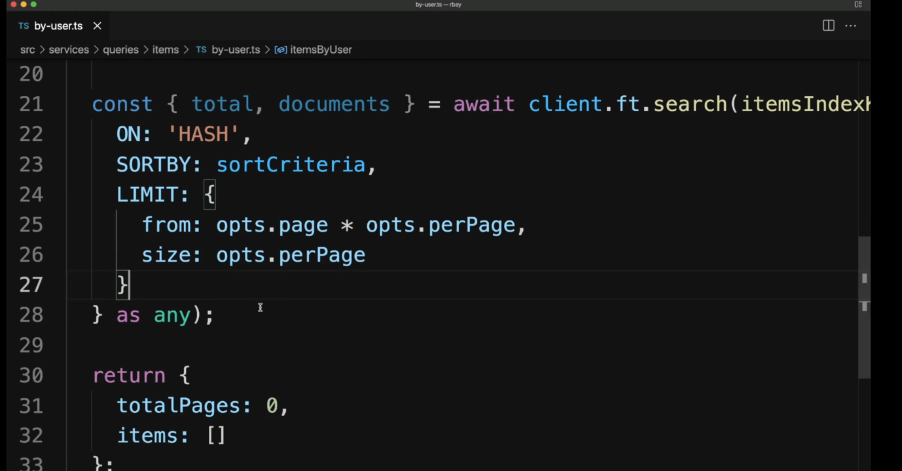

* 

## Section 21: Service Communication with Streams

* 

* 

* 

* 

* 

* 

* 

* 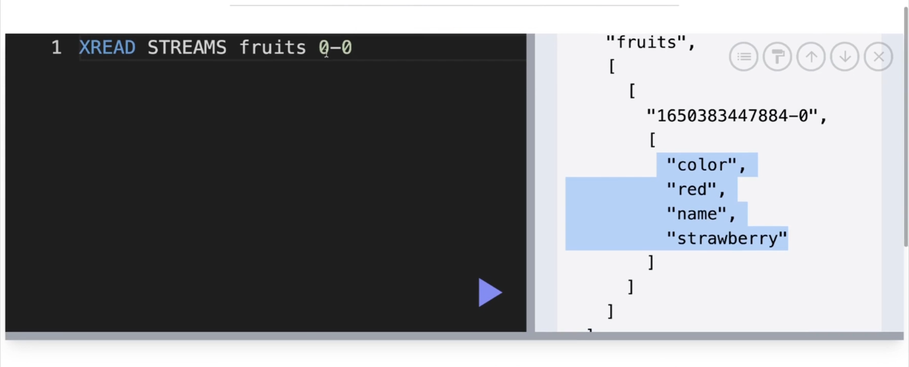

* 

* 

* 

* 

* 

* 

* 

* 

* 

* 

* 

* 

* 

* 

* 

* 

* 

* 

* 

* 

* 

* 

* 

* 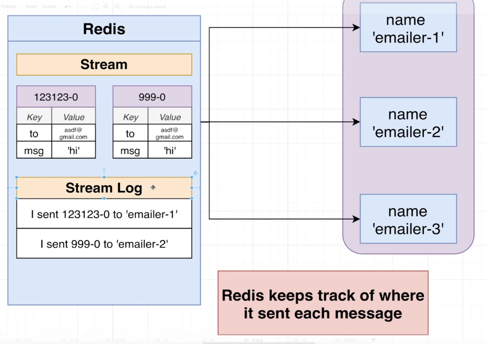

* 

* 

* 

* 

* 

* 