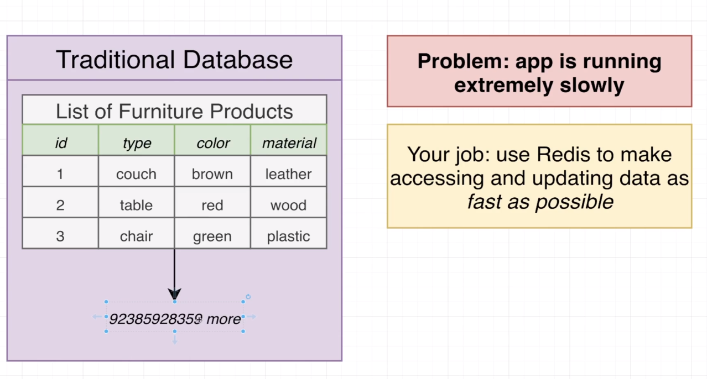

# Redis: The Complete Developer's Guide

## Section 2: Commands for Adding and Querying Data

* ```redis
    SET message 'Hi message!'
    GET message
    ```

* 

* 

* 

* 

* redis.io/commands

* 

* 
    * As an example, the `expiration` parameter is super useful when we are caching information a database.

* 

* 

* 

* 

* 

* 

* 

* 

* 

* 

* 

* 

* 

* 

* 

* 

* 

* 

* 

* 
    * Those commands exist because of race conditions. One example would be two separate servers running the same backend code doing a `GET`, increamenting the value and after that doing a `SET`. At some point those two servers would `GET` the same value and override each others increment operation. This is a typical race condition.

* 

## Section 4: Local Redis Setup

* `Redis Stack` contains the core Redis database and some additional modules that extend the functionality of Redis.

* If you do not already have HomeBrew installed, navigate to https://brew.sh/ and run the command at the top in your terminal to install HomeBrew

* At your terminal, run `brew tap redis-stack/redis-stack`

* At your terminal, run `brew install redis-stack`

* To start Redis, run `redis-stack-server`

* To connect to your local Redis server and execute commands, run `redis-cli`

## Hashes in Redis

* 

* 

* 

* 

* 

* 

* 

* 

* 

* 
    * If you try to increment a key that does not exist, it will create it automatically.

* 

* 

## Section 8: Pipelining Commands

* Redis Pipelining
    * A Request/Response server can be implemented so that it is able to process new requests even if the client hasn't already read the old responses. This way it is possible to send multiple commands to the server without waiting for the replies at all, and finally read the replies in a single step.

    * This is called pipelining, and is a technique widely in use for many decades. For instance many POP3 protocol implementations already support this feature, dramatically speeding up the process of downloading new emails from the server.

## Section 9: Enforcing Uniqueness with Sets


* 

* 

* 

* 

* 

* 

* 

* 

* 
    * The first `set` dictates the intersect result.

* 

* 

* 

* 

* 

* 

* 

* 

## Section 11: Organizing Data with Sorted Sets

* 

* 

* 

* 

* 

* 

* 

* 

* 

* 

* 

* 

* 

* 

* 

* 

* 

* 

* 

* 

* 
    * `REV` reverts the sorted set from `ASC` to `DSC`.

## Section 13: From Relational Data to Redis

* 
    * `SORT` is a great way to `JOIN` data. You can first get a set of `keys` from a `set` and the use that to search for other `keys`.
        * e.g. `books:*->year`. The `*` is used to look for other keys.

* 

* 

* 

* 

* 

* 

* 

* 

* 

* 

* 

## Section 14: HyeperLogLog Structures

* 

* 

* 

* 

* 

* 

* 
